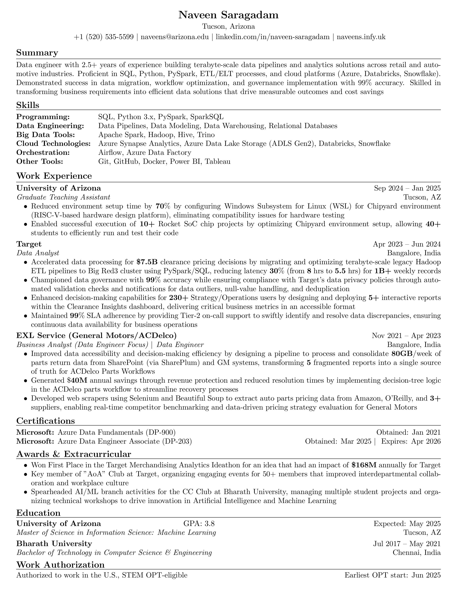

# Professional Resume


A modern, professional resume template built using LaTeX. This repository contains both the source files and compiled PDF version of my resume.

## Preview
[](./output/resume.pdf)  
*Click the image to view PDF*

## Features
- Clean and professional design
- Easy to customize sections
- Mobile-friendly layout
- Automated PDF generation
- Semantic markup for better readability

## Project Structure
```bash
.
your-resume-repo/
├── README.md
├── .gitignore
├── src/
│   └── resume.tex      # LaTeX source files
├── output/
│    └── resume.pdf   # Compiled PDF version
└── pdf/
     └── resume-thumbnail.jpg  # Image verison of Resume

```

## Usage
1. Clone the repository:
```bash
git clone https://github.com/naveenksaragadam/Resume.git
```

2. Edit the LaTeX files in `src/` directory

3. Compile using your preferred LaTeX editor:
```bash
pdflatex src/resume.tex
```

4. The compiled PDF will be generated in the root directory

## Customization
- Update personal information in `resume.tex`
- Modify section files in `sections/` directory
- Adjust styling in `assets/custom.cls`

## License
This project is licensed under the MIT License - see the [LICENSE](LICENSE) file for details.

---

*Maintained by [naveenksaragadam](https://github.com/naveenksaragadam)*
